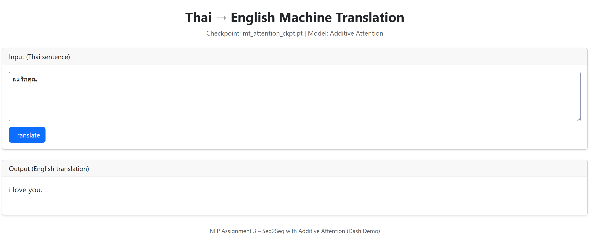

# 🧠 Thai → English Machine Translation  
### Seq2Seq with Additive Attention (PyTorch + Dash)

This project is part of **NLP Assignment 3 – Make Your Own Machine Translation Language**.  
We implement a **Thai → English Machine Translation system** using a **Seq2Seq model with Additive Attention**, trained in PyTorch and deployed as a web application using **Dash**.

---

## 📌 Features

- Seq2Seq Encoder–Decoder architecture (GRU-based)
- Additive (Bahdanau) Attention mechanism
- Thai tokenization using **PyThaiNLP (newmm)**
- Trained model checkpoint for inference
- Interactive web demo using **Dash**
- CPU-friendly (no GPU required)

---

## 🧩 Model Architecture

### Encoder
- Embedding layer
- Bidirectional GRU
- Hidden state projection

### Decoder
- Embedding layer
- Additive Attention
- GRU
- Linear output layer over target vocabulary

### Attention
- Additive (Bahdanau) Attention
- Computes alignment between decoder hidden state and encoder outputs

---

## 📂 Project Structure

```
A3-Machine-Translation/
│
├── app.py                  # Dash web application
├── mt_attention_ckpt.pt    # Trained model checkpoint
├── requirements.txt        # Python dependencies
├── README.md               # Project documentation
│
├── data/
│   ├── raw/                # Raw OpenSubtitles data
│   └── processed/          # train / valid / test TSV files
│
├── st126130_notebook_A3.ipynb  # Training & experiments notebook
```

---

## ⚙️ Installation

### 1. Create virtual environment (optional)

```bash
python -m venv vn_A3
source vn_A3/bin/activate        # macOS / Linux
vn_A3\Scripts\activate           # Windows
```

### 2. Install dependencies

```bash
pip install -r requirements.txt
```

### Required Packages
- torch
- numpy
- pythainlp
- dash
- dash-bootstrap-components

---

## ▶️ Running the Web Application

Start the Dash app:

```bash
python app.py
```

You should see:

```
Dash is running on http://127.0.0.1:8050/
```

Open your browser at:

👉 **http://127.0.0.1:8050/**

---

## 🌐 How to Use the Web Interface

1. Enter a **Thai sentence** in the text area  
   Example:
   ```
   ฉันรักประเทศไทย
   ```

2. Click the **Translate** button

3. The translated **English sentence** will appear below

---

### Web-based Machine Translation Demo (Dash)

The following screenshot shows the deployed Dash web application for Thai → English machine translation using a Seq2Seq model with Additive Attention.




## 📦 Model Checkpoint

The checkpoint file `mt_attention_ckpt.pt` contains:
- Encoder–Decoder parameters
- Additive and General attention state dictionaries
- Vocabulary mappings (stoi / itos)
- Model configuration

---

## 📝 Assignment Tasks Covered

- Task 1: Language Pair Preparation
- Task 2: Tokenization & Vocabulary
- Task 3: Seq2Seq with Attention
- Task 4: Web-based Inference Demo

---

## 👤 Author

- Student ID: **st126130**
- Course: Natural Language Processing

---

## 📜 License

Educational use only.
